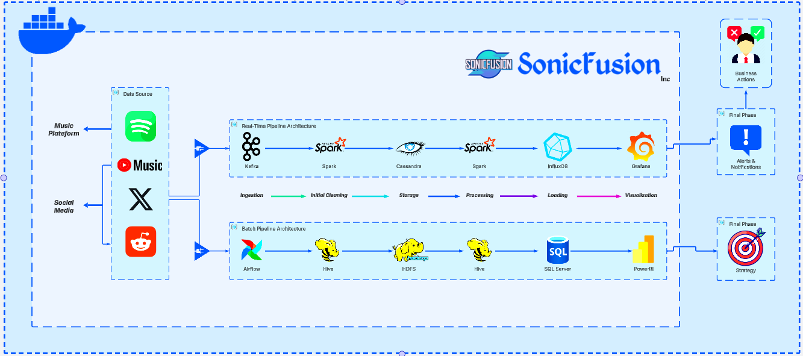

### Sonic Fusion is a dual-architecture data pipeline that delivers **real-time** and **batch** analytics for the music industry. By unifying streaming platforms and social media sources, it enables labels, artists, and marketers to gain data-driven insights into listener trends, track performance, and audience engagement---all in a scalable, containerized solution.
------------

Key Features
------------

-   **Real-Time Pipeline** ⚡

    -   **Kafka**: High-throughput data ingestion
    -   **Spark**: Stream processing and analytics
    -   **Cassandra**: Low-latency storage for real-time events
    -   **InfluxDB**: Time-series data repository
    -   **Grafana**: Real-time dashboarding and visualization
-   **Batch Pipeline** ⏳

    -   **Airflow**: Orchestrates scheduled ETL workflows
    -   **Hive**: SQL-like querying on HDFS data
    -   **HDFS**: Distributed file system for large-scale storage
    -   **SQL Server**: Data warehousing for long-term analytics
    -   **Power BI**: Business intelligence and advanced reporting
-   **Containerized Deployment** 🐳

    -   Runs seamlessly on Docker, simplifying environment setup and scaling.

Architecture Overview
---------------------

1.  **Data Sources**: Ingest music and user engagement data from streaming platforms (Spotify, Apple Music, etc.) and social media (X/Twitter, Reddit, Instagram).
2.  **Real-Time Pipeline**: Kafka streams the data, Spark processes it, Cassandra stores it for fast reads, InfluxDB tracks time-series metrics, and Grafana provides live dashboards.
3.  **Batch Pipeline**: Airflow schedules and orchestrates jobs, Hive/HDFS stores large datasets, Spark (batch mode) performs transformations, and results are loaded into SQL Server for final warehousing and analysis in Power BI.
4.  **Insights & Visualization**: Grafana for immediate feedback on streaming data, Power BI for deeper historical analysis, and combined intelligence for data-driven decisions.

Getting Started
---------------

1.  **Clone the Repo**
```bash
git clone https://github.com/your-username/sonic-fusion.git\
cd sonic-fusion
```

**Set Environment Variables (Optional)**\
Create a `.env` file to customize variables like:

```bash
AIRFLOW_IMAGE_NAME=apache/airflow:2.5.1\
AIRFLOW_UID=50000\
AIRFLOW_PROJ_DIR=.\
KAFKA_BROKER_URL=...\
# etc.
```

**Deploy via Docker Compose**
```bash
docker-compose up -d
```

1.  **Services & Ports**

    -   **Kafka**: Typically on port 9092 (check `docker-compose.yml`)
    -   **Spark**: Various ports for Spark master/worker UIs
    -   **Airflow UI**: <http://localhost:8080>
    -   **Grafana**: http://localhost:3000 (or the port you mapped)
    -   **Power BI**: External tool connecting to SQL Server (port 1433)

Usage
-----

-   **Real-Time Monitoring**: Head to Grafana to view streaming metrics and time-series dashboards.
-   **Batch Analysis**: Connect to SQL Server from Power BI for deeper, scheduled reporting.
-   **Orchestration**: Access the Airflow UI for managing DAGs, scheduling batch jobs, and monitoring job status.

Contributing
------------

Contributions, feature requests, and bug reports are welcome!

1.  Fork the repo
2.  Create a new branch
3.  Make changes and commit
4.  Open a Pull Request

License
-------

This project is licensed under the [Apache License 2.0](LICENSE).
